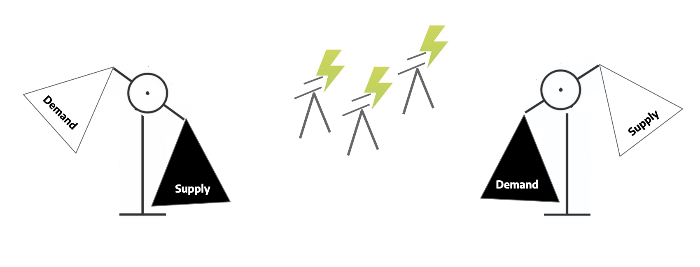
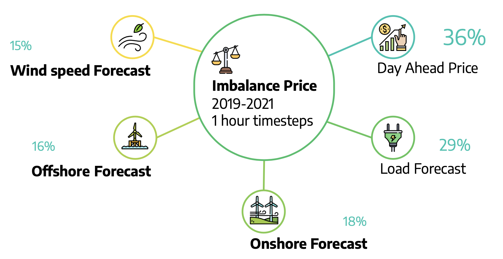
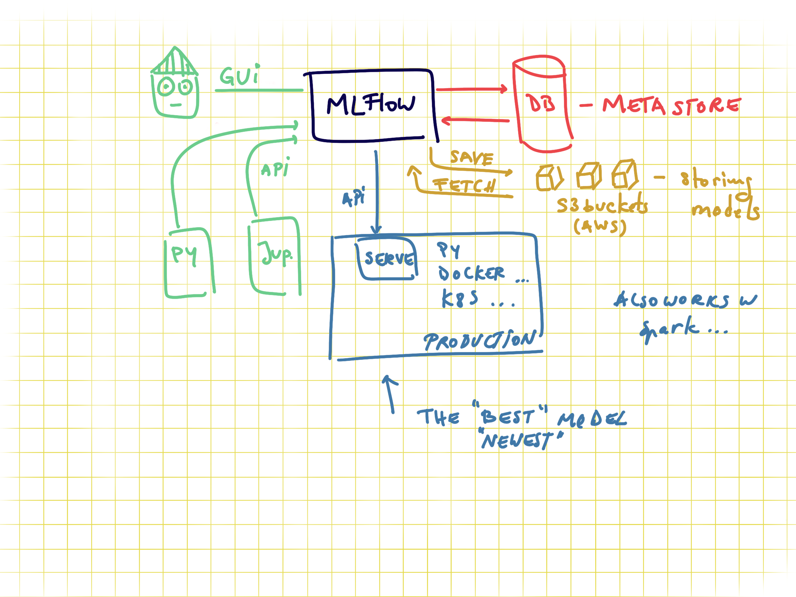

# __Capstone: Predicting the imbalance energy price__

This was the capstone project done at the Data Science Bootcamp @neuefische. This project has been developed in 4 weeks in November 2021 by Aaron Holstein ([Git](https://github.com/AaronsHub)), Katrin Mulinski ([Git](https://github.com/IronMan2483) | [LinkedIn](https://www.linkedin.com/in/katrin-mulinski-81ab5622/)), Laurent Hartmann ([Git](https://github.com/laurantirkh) | [LinkedIn](https://www.linkedin.com/in/laurent-hartmann-134524bb/)) and Ravi Tripathi ([Git](https://github.com/ravitpt87) | [LinkedIn](https://www.linkedin.com/in/ravi-tripathi-phd-95a128179/)).

---
## __Our topic__

Imbalance energy is the energy fed into or extracted from the power transmission net by the transmission net operator to avoid grid instability and to keep the balance between demand and supply. Our goal is to forecast this highly volatile price for the next several hours to be able to make purchase and sale decisions to avoid losing money in case additional energy is needed.



---

## __Repo structure__

* our final notebooks about Data Cleaning, Mining and EDA and the different models are [here](https://github.com/AaronsHub/capstone_energy/tree/main/final_notebooks)
* used and created images are [here](https://github.com/AaronsHub/capstone_energy/tree/main/images)

---

## __Data Overview__

After cleaning the data of 1 json and 11 csv files, we aggregated the dataset to an hourly timespan: 2019-01-01 00:00:00 until 2020-09-30 23:00:00

We selected the following features:



---
## __Requirements__

- pyenv with Python: 3.9.4
- Pandas
- Matplotlib
- Seaborn
- Plotly

---
## __Setup__

Use the requirements file in this repo to create a new environment.

```BASH
make setup

#or

pyenv local 3.9.4
python -m venv .venv
source .venv/bin/activate
pip install --upgrade pip
pip install -r requirements_dev.txt
```

The `requirements.txt` file contains the libraries needed for deployment.. of model or dashboard .. thus no jupyter or other libs used during development.

---

__NEED TO DECIDE IF AND HOW WE LEAVE THE REST OF THE TEXT HERE__


The MLFLOW URI should **not be stored on git**, you have two options, to save it locally in the `.mlflow_uri` file:

```BASH
echo http://127.0.0.1:5000/ > .mlflow_uri
```

This will create a local file where the uri is stored which will not be added on github (`.mlflow_uri` is in the `.gitignore` file). Alternatively you can export it as an environment variable with

```bash
export MLFLOW_URI=http://127.0.0.1:5000/
```

This links to your local mlflow, if you want to use a different one, then change the set uri.

The code in the [config.py](modeling/config.py) will try to read it locally and if the file doesn't exist will look in the env var.. IF that is not set the URI will be empty in your code.

## Usage

### Creating an MLFlow experiment

You can do it via the GUI or via [command line](https://www.mlflow.org/docs/latest/tracking.html#managing-experiments-and-runs-with-the-tracking-service-api) if you use the local mlflow:

```bash
mlflow experiments create --experiment-name 0-template-ds-modeling
```

Check your local mlflow

```bash
mlflow ui
```

and open the link [http://127.0.0.1:5000](http://127.0.0.1:5000)

This will throw an error if the experiment already exists. **Save the experiment name in the [config file](modeling/config.py).**

In order to train the model and store test data in the data folder and the model in models run:

```bash
#activate env
source .venv/bin/activate

python -m modeling.train
```

In order to test that predict works on a test set you created run:

```bash
python modeling/predict.py models/linear data/X_test.csv data/y_test.csv
```

## About MLFLOW -- delete this when using the template

MLFlow is a tool for tracking ML experiments. You can run it locally or remotely. It stores all the information about experiments in a database.
And you can see the overview via the GUI or access it via APIs. Sending data to mlflow is done via APIs. And with mlflow you can also store models on S3 where you version them and tag them as production for serving them in production.


### MLFlow GUI

You can group model trainings in experiments. The granularity of what an experiment is up to your usecase. Recommended is to have an experiment per data product, as for all the runs in an experiment you can compare the results.


### Code to send data to MLFlow

In order to send data about your model you need to set the connection information, via the tracking uri and also the experiment name (otherwise the default one is used). One run represents a model, and all the rest is metadata. For example if you want to save train MSE, test MSE and validation MSE you need to name them as 3 different metrics.
If you are doing CV you can set the tracking as nested.


### MLFlow metadata

There is no constraint between runs to have the same metadata tracked. I.e. for one run you can track different tags, different metrics, and different parameters (in cv some parameters might not exist for some runs so this .. makes sense to be flexible).

- tags can be anything you want.. like if you do CV you might want to tag the best model as "best"
- params are perfect for hypermeters and also for information about the data pipeline you use, if you scaling vs normalization and so on
- metrics.. should be numeric values as these can get plotted


